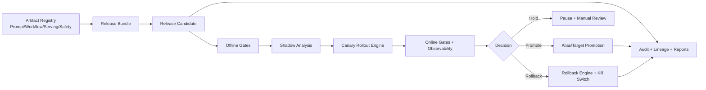
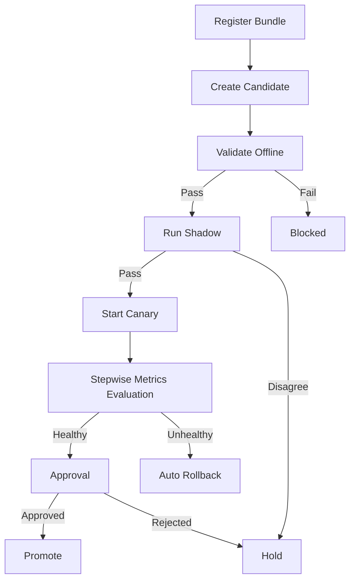

# AI Release Governance & Deployment Control Plane

Policy-driven control plane for safe AI release promotion across `dev`, `qa`, `staging`, and `prod`.  
It governs prompts, workflows, serving configuration, safety policies, and traffic exposure using offline/online gates, shadow testing, canary rollout, approvals, observability signals, and automated rollback.

## Why This Matters

AI releases are high-dimensional changes: prompt updates, workflow logic, model config, routing, and policy guardrails can regress quality or reliability independently.  
This platform gives engineering + SRE a deterministic release process with:

- governed artifact bundles and immutable release candidates
- policy gate enforcement
- progressive rollout controls
- rollback automation
- searchable audit trail + decision memos

## Architecture Overview



## Release Workflow



## Core Concepts

- **Release Bundle**: versioned set of prompt/workflow/serving/safety references + ownership + risk metadata.
- **Release Candidate**: immutable candidate with digest; unit of gate evaluation and rollout.
- **Policy Bundle**: environment-aware gate thresholds (hard fail + warn-only + escalation + freeze windows).
- **Rollout Plan**: composable steps (`shadow`, `canary`, `progressive`, `full`, `approval`).
- **Decision Memo**: offline + shadow + canary + online + approval + health evidence and recommendation.

## Repository Walkthrough

```text
ai-release-governance-control-plane/
  configs/                    # bundles, policies, rollout strategies, approvals, observability
  data/                       # sample metadata + telemetry
  src/ai_release_control_plane/
    schemas/                 # Pydantic models for release artifacts and decisions
    policy/                  # policy engine + evaluation provider
    shadow/                  # shadow traffic analysis engine
    canary/                  # canary analysis
    rollout/                 # rollout runtime + exposure controllers
    rollback/                # rollback decision/execution
    approvals/               # approval workflow engine
    observability/           # provider abstractions + health aggregation
    storage/                 # filesystem + SQLite storage
    release/                 # bundle diff + lineage
    reports/                 # JSON/CSV/MD/HTML report generation
    runtime/                 # orchestration control plane
    cli.py                   # releasectl command interface
  tests/                      # schema, policy, rollout, rollback, CLI, e2e tests
  docker/                     # Dockerfile + compose
  .github/workflows/ci.yml    # lint/test/demo CI
```

## Installation

1. Python 3.11+
2. Optional: Docker

```bash
make install
```

## Step-by-Step Walkthrough

### Step 1: Clone repo
```bash
git clone <your-repo-url>
cd AI-Release-Governance-Deployment-Control-Plane
```

### Step 2: Create virtual environment
```bash
python -m venv .venv
source .venv/bin/activate  # Windows PowerShell: .venv\Scripts\Activate.ps1
```

### Step 3: Install dependencies
```bash
make install
```

### Step 4: Register a sample release bundle
```bash
python -m ai_release_control_plane.cli register-bundle --file configs/bundles/full_bundle_success.yaml
```

### Step 5: Run offline validation
```bash
python -m ai_release_control_plane.cli validate-offline --bundle release_bundle_001 --environment staging
```

### Step 6: Run shadow analysis
```bash
python -m ai_release_control_plane.cli run-shadow --bundle release_bundle_001
```

### Step 7: Start a canary rollout
```bash
python -m ai_release_control_plane.cli rollout start --bundle release_bundle_001 --environment prod --strategy canary
```

### Step 8: Inspect health and policy gates
```bash
python -m ai_release_control_plane.cli inspect --entity online_gate_results
python -m ai_release_control_plane.cli inspect --entity canary_results
```

### Step 9: Approve promotion
```bash
python -m ai_release_control_plane.cli approve --bundle release_bundle_001 --role release_board --approver release-manager
```

### Step 10: Simulate a failed rollout
```bash
python -m ai_release_control_plane.cli demo-run --scenario rollback_canary --profile local-demo
```

### Step 11: Execute rollback
```bash
python -m ai_release_control_plane.cli rollback --bundle release_bundle_003 --reason "quality regression"
```

### Step 12: Generate a final release decision report
```bash
python -m ai_release_control_plane.cli report --bundle release_bundle_001 --format html
```

## Command Examples

```bash
make install
make test
make demo

python -m ai_release_control_plane.cli register-bundle --file configs/bundles/customer_support_release_v2.yaml
python -m ai_release_control_plane.cli validate-offline --bundle release_bundle_001 --environment staging
python -m ai_release_control_plane.cli run-shadow --bundle release_bundle_001 --environment prod
python -m ai_release_control_plane.cli rollout start --bundle release_bundle_001 --strategy canary --environment prod
python -m ai_release_control_plane.cli approve --bundle release_bundle_001 --environment prod
python -m ai_release_control_plane.cli rollback --bundle release_bundle_001 --reason "quality regression"
python -m ai_release_control_plane.cli report --bundle release_bundle_001 --format html
```

## Demo Scenarios

- `success`: full successful promotion
- `blocked_offline`: release blocked by offline gates
- `shadow_disagreement`: shadow hold recommendation
- `rollback_canary`: canary failure with automatic rollback

Run:
```bash
python -m ai_release_control_plane.cli demo-run --scenario success --profile local-demo
python -m ai_release_control_plane.cli demo-run --scenario blocked_offline --profile local-demo
python -m ai_release_control_plane.cli demo-run --scenario rollback_canary --profile local-demo
```

## Configuration Guide

All runtime controls are YAML-driven:

- `configs/bundles/`: release bundle definitions
- `configs/policies/`: gate thresholds and escalation
- `configs/rollout_strategies/`: canary/progressive steps
- `configs/approvals/`: role requirements by risk/environment
- `configs/environments/`: environment alias mappings
- `configs/observability/`: telemetry and health config

Profiles: `local-demo`, `dev`, `staging`, `prod`, `ci-smoke`.

## Extensibility Guides

### Add a new policy

1. Add a YAML rule in `configs/policies/<profile>.yaml`.
2. Use existing rule keys or extend `RulePolicyEngine` metric maps.
3. Validate with `python -m ai_release_control_plane.cli doctor`.

### Add a new artifact type

1. Add a model in `schemas/models.py`.
2. Extend `ReleaseBundle` references.
3. Extend diff/lineage + report rendering.
4. Add tests in `tests/`.

### Add a new rollout strategy

1. Add strategy under `configs/rollout_strategies/<profile>.yaml`.
2. Pass strategy: `rollout start --strategy <name>`.
3. Add optional analysis logic in `canary/engine.py`.

### Plugin guide (controllers/providers)

Implement these abstractions:

- `PromptRegistryClient`
- `WorkflowRegistryClient`
- `ServingConfigClient`
- `ExposureController`
- `ObservabilityProvider`
- `EvaluationProvider`
- `PolicyDecisionEngine`

Wire them in `runtime/control_plane.py` for real integrations.

## Reports and Dashboards

Outputs supported:

- JSON
- CSV
- Markdown
- HTML

Generated examples:

- release decision memo
- canary/online analysis snapshots
- rollback incident summary
- audit trail
- lineage records
- environment alias history

## Debugging Failed Releases

1. Inspect policy output: `inspect --entity offline_gate_results`
2. Inspect canary and online metrics
3. Inspect rollback decisions and audit records
4. Regenerate memo in markdown/html for incident review

## Governance and Auditability

The system stores:

- immutable candidate records with digest
- approval records with actor/role/reason
- promotion and rollback decisions
- audit events for register/approve/promote/rollback
- lineage records for environment alias movement

## Troubleshooting

- `doctor` command fails:
  - verify profile config files exist
  - verify state/reports directories are writable
- no report output:
  - check `ARCP_REPORTS_DIR`
- release unexpectedly blocked:
  - check hard-fail thresholds in active policy profile

## FAQ

**Q: Is this tied to one LLM vendor?**  
A: No. The architecture is provider-agnostic with pluggable clients.

**Q: Can I run without external systems?**  
A: Yes. `mock` mode provides full synthetic release simulation.

**Q: Can I use real observability and deployment systems?**  
A: Yes. Replace stubs with adapters and wire in `ControlPlane`.

## Limitations

- Demo mode uses synthetic quality/telemetry signals.
- Rollout engine is stateful local metadata, not a distributed coordinator.
- Real-time stream processing is stubbed behind provider interfaces.

## Future Enhancements

- event bus + async workers for rollout monitoring
- richer policy DSL and temporal rules
- multi-region environment orchestration
- static web dashboard for lineage and live rollout health
- notebook-based rollout analytics

## Docker

```bash
docker build -f docker/Dockerfile -t ai-release-control-plane .
docker run --rm ai-release-control-plane
```

Or:
```bash
cd docker
docker compose up --build
```
